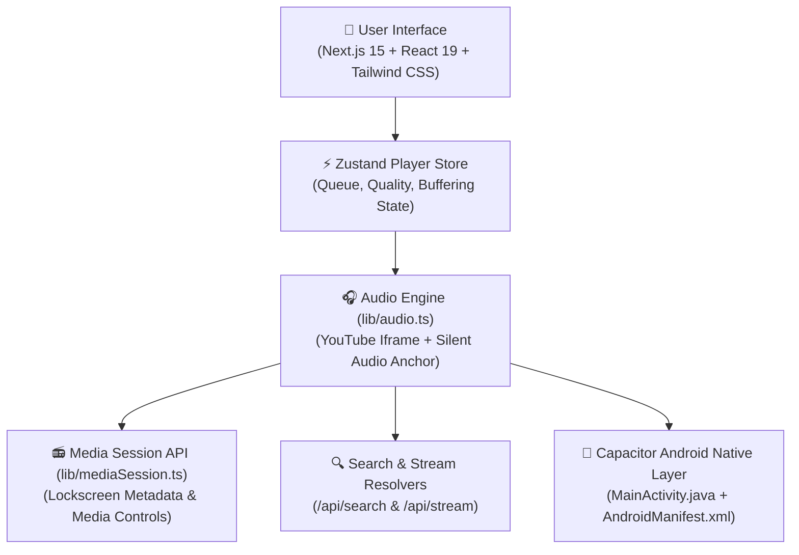

# 🎧 Audiophilic

**Audiophilic** is a high-performance, zero-authentication YouTube Music streaming web application and native Android app. Built with Next.js 15, Tailwind CSS, Zustand, and Capacitor, Audiophilic delivers full-length music streaming with interactive quality selection, lock-screen media controls, and background playback support across Desktop, Mobile Browsers, and Android devices.

---

## 🌟 Key Features

- **🎵 100% YouTube Music Backend**: Stream full-length songs (3–5+ mins) without 30-second truncations, login prompts, or API key limits.
- **⚡ Zero-Latency Search & Streaming**: Real-time YouTube Music scraping delivering titles, artists, high-res thumbnails, and track durations.
- **🎚️ Interactive Quality Selector**: Dynamically select streaming quality (`Low`, `Medium`, `High`, `Hi-Res`) directly from the player.
- **📀 Spinning Vinyl Buffering Indicator**: Visual loading state powered by an animated spinning vinyl using custom app artwork (`/icon.png`).
- **📻 Continuous Background Playback**: Uninterrupted audio playback on Desktop, Mobile Chrome/Safari, and Android when switching tabs or locking the screen.
- **📲 Native Android APK**: Built with Capacitor, featuring custom launcher icons, foreground media playback permissions, and a versioned releases pipeline.

---

## 🏗️ Architecture & Technical Design



### 1. Dual Audio Engine & Background Playback Strategy (`lib/audio.ts`)
- **Official Client Engine (`YT.Player`)**: Streams tracks directly via YouTube's official HTML5 client API, bypassing third-party proxy blocks and signature errors.
- **In-Viewport DOM Placement**: Renders the player iframe inside the active viewport (`bottom: 0`, `right: 0`, `opacity: 0.001`, `zIndex: -9999`) to prevent browser engines from freezing hidden background iframes.
- **Silent Audio Anchor (`SILENT_AUDIO_WAV`)**: Runs a 1-second silent WAV loop on an HTML5 `<audio>` element in parallel with `YT.Player`. This maintains active browser audio session focus during tab switches and screen locks.

### 2. Media Session Integration (`lib/mediaSession.ts`)
- Populates `navigator.mediaSession` metadata with track title, artist, album, and high-resolution artwork (`150x150`, `480x480`, `1000x1000`).
- Registers OS-level media action handlers (`play`, `pause`, `previoustrack`, `nexttrack`, `seekto`, `seekbackward`, `seekforward`) for lock screen widgets and Bluetooth controls.

### 3. Capacitor Android Native Layer
- **WebView Resume Override (`MainActivity.java`)**: Overrides `onPause()` to call `bridge.getWebView().onResume()` and `resumeTimers()`, preventing Android WebView from suspending JavaScript timers or pausing audio playback when minimized.
- **Foreground Permissions (`AndroidManifest.xml`)**: Configured with `WAKE_LOCK`, `FOREGROUND_SERVICE`, and `FOREGROUND_SERVICE_MEDIA_PLAYBACK` permissions.

---

## 📁 Directory Structure

```text
Audiophilic/
├── android/                   # Native Android Capacitor Project
│   ├── app/src/main/
│   │   ├── java/com/audiophilic/music/MainActivity.java  # WebView background keeper
│   │   ├── res/mipmap-*/                                  # Custom Launcher Icons
│   │   └── AndroidManifest.xml                            # Foreground media permissions
│   └── build.gradle           # Root Gradle build config (Java 17 & Android 35)
├── app/                       # Next.js App Router
│   ├── api/search/route.ts    # Direct YouTube Music search scraper
│   ├── api/stream/route.ts    # Audio stream resolver & Range proxy
│   ├── layout.tsx             # Root layout & Metadata
│   └── page.tsx               # Main application player page
├── components/                # React UI Components
│   ├── AudioController.tsx    # Audio engine bridge & MediaSession updater
│   ├── FullPlayer.tsx         # Full-screen player modal & quality pills
│   ├── MiniPlayer.tsx         # Sticky bottom player bar
│   └── TrackCard.tsx          # Track list card with vinyl spinner
├── lib/                       # Core Audio & Scraper Logic
│   ├── api.ts                 # Search API client
│   ├── audio.ts               # AudioEngine singleton class
│   └── mediaSession.ts        # OS Media Session handlers
├── public/                    # Static Assets (icon.png, logo.png)
├── releases/                  # Build Output Folder for Versioned APKs
│   └── Audiophilic-v1.1.1.apk # Compiled Android Release APKs
├── store/                     # Global State Management
│   └── usePlayerStore.ts      # Zustand player store (queue, progress, quality)
├── capacitor.config.ts        # Capacitor configuration
└── package.json               # Project dependencies & versioning
```

---

## 🛠️ Development & Building

### Prerequisites
- **Node.js**: v18 or later
- **Java JDK**: OpenJDK 17
- **Android SDK**: API Level 35 (`platforms;android-35` & `build-tools;35.0.0`)

### Running Web App Locally
```bash
# Install dependencies
npm install

# Start Next.js development server
npm run dev
```
Open `http://localhost:3000` in your browser.

### Rebuilding the Android APK (Versioned Release)
To compile a fresh versioned Android APK:
```bash
node scratch/build_release_apk.js
```

The script will automatically:
1. Increment the version number in `package.json` and `android/app/build.gradle`.
2. Run `gradle clean assembleDebug --rerun-tasks` to bypass cache and force clean compilation.
3. Output the compiled binary to `releases/Audiophilic-vX.Y.Z.apk` and update `Audiophilic.apk` in the root directory.

---

## 🚀 Live Demo & Artifacts

- **Live Web App**: [https://audiophilic-gules.vercel.app](https://audiophilic-gules.vercel.app)
- **Latest Android APK**: `releases/Audiophilic-v1.1.1.apk`

